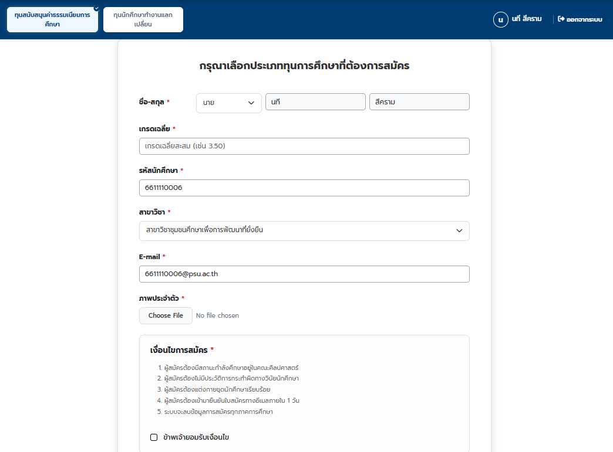
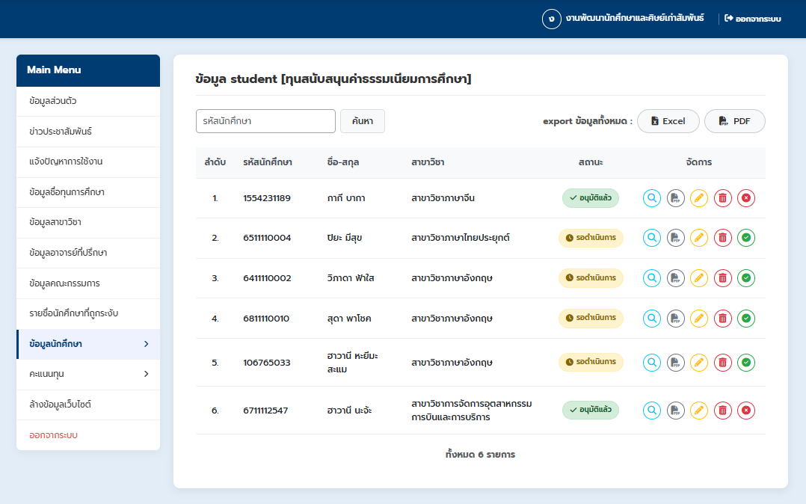
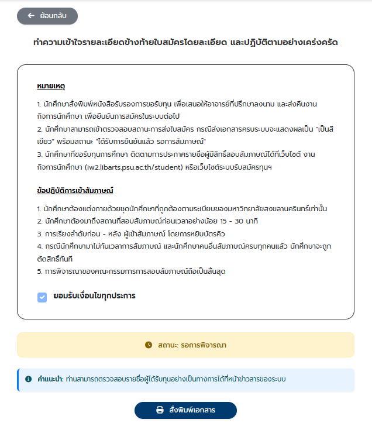

# ชื่อระบบ
E-scholarship-LA
ระบบรับสมัครทุนการศึกษาและการพิจารณาข้อมูลแบบอิเล็กทรอนิกส์
|
เป็นระบบสำหรับการสมัครทุนการศึกษา ติดตามผล พร้อมทั้งการพิจารณาข้อมูลและให้คะแนนของคณะกรรมการ

# ฟีเจอร์หลักของระบบ
แอดมิน : สามารถจัดการข้อมูลของผู้ใช้ได้ทุกส่วน

นักศึกษา : สามารถสมัครและติดตามข้อมูลข่าวสารทุนต่างๆที่มหาวิทยาเปิดได้

คณะกรรมการ : สามารถให้คะแนนและความคิดเห็นแก่นักศึกษาที่ส่งใบสมัครได้

# ภาษาที่ใช้
HTML+CSS+JavaScript+Bootstrap สำหรับส่วนของ Fontend
PHP สำหรับจัดการฐานข้อมูล
MySQL สำหรับเก็บฐานข้อมูล

# วิธี setup เพื่อ run บนเครื่อง
1.ติดตั้ง XAMPP
2.วางโฟลเดอร์โปรเจกต์ไว้ใน `C:/xampp/htdocs/`
3.เปิด phpMyAdmin แล้ว import ไฟล์ `database/scholarship.sql`
4.แก้ไขไฟล์ `include/config.php` ให้ตรงกับเครื่องของตัวเอง
5.เปิดเบราว์เซอร์แล้วไปที่ `localhost/scholar`

# หน้าตาของระบบ
หน้าเข้าสู่ระบบ

หน้าสมัครทุน

หน้าจัดการทุนนักศึกษาของแอดมิน

หน้าติดตามสถานะทุน

# สิ่งที่ได้เรียนรู้จากโปรเจคนี้
1.ได้เรียนรู้การวางแผนการสร้างระบบว่าควรทำส่วนของผู้ใช้ไหนก่อน ผู้ใช้คนไหนต้องเชื่อมข้อมูลกัน เป็นต้น
2.ได้เรียนรู้การพัฒนาระบบให้ดีกว่าระบบเดิมที่มีอยู่ เพราะเดิมทีระบบสมัครทุนนี้มีอยู่แล้ว เพียงแต่ UI ความปลอดภัย และ responsive ยังทำได้ไม่ดี 
3.ได้ฝึกทักษะการออกแบบให้รูปแบบเว็บไซต์ทันสมัยมากขึ้น แต่ก็คงความใช้งานง่ายไว้
4.ได้ฝึกใช้ bootstrap เพราะปกติใช้ css pure ทำให้เห็นแนวทางการสร้างระบบที่มีเรื่อง responsive ให้อยู่แล้วมันลดเวลาการเขียนโค้ดได้เยอะ

# ปัญหาที่เจอและวิธีแก้
1.ข้อมูลการสมัครที่นักศึกษากดส่งไม่ถูกส่งไปยังแอดมินละคณะกรรมการ หรือข้อมูลที่ส่งถึงก็จะเป็นข้อมูลที่ไม่ครบ
|--วิธีแก้--|
เช็คว่าข้อมูลที่นักศึกษากรอกถูกบันทึกลงในฐานข้อมูลไหม
ถ้าถูกบันทึกลงในฐานข้อมูล แต่ไม่ปรากฎในหน้าแอดมินและคณะกรรมการ
เช็ค php ในหน้าแอดมินและคณะกรรมการว่าดึงข้อมูลมาแสดงถูกไหม 
แต่ถ้าไม่ถูกบันทึกลงในฐานข้อมูล 
เช็ค php ในหน้านักศึกษาว่ากำหนดการบันทึกข้อมูลลงในฐานข้อมูลถูกไหม
และทำการแก้ตามสาเหตุที่เจอ 

2.หน้าจอแสดงผลไม่ถูกต้องบนหน้าจอขนาดต่างๆ
|--วิธีแก้--| 
ปรับการใช้ Bootstrap ให้ถูกต้องเพื่อให้รองรับทุกขนาดหน้าจอ